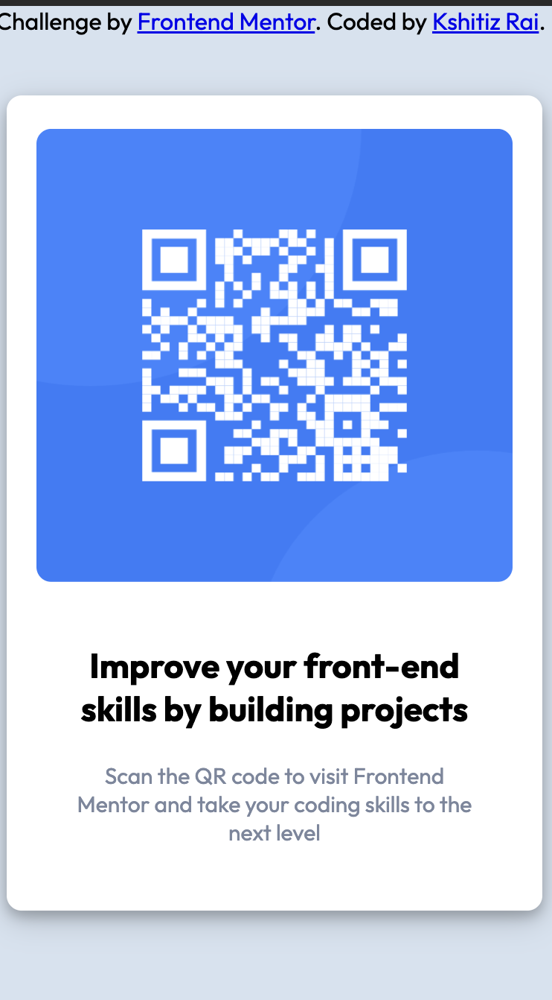

## Overview

### Screenshot

#### Desktop View:

#### Mobile view:

### Links

- Solution URL: [Github](https://github.com/Kshitiz42069/frontend-mentor-QR)
- Live Site URL: [Live link](https://kshitiz42069.github.io/frontend-mentor-QR/)

## My process

### Built with

- Semantic HTML5 markup
- CSS custom properties
- Flexbox

### What I learned

With the help of this assignment I learned CSS specially flex-box and also how to make a site responsive using CSS. I have also learned about how to provide shadow to a particular section.

## Author

- Website - [QR template]()
- Frontend Mentor - [@Kshitiz](https://www.frontendmentor.io/profile/Kshitiz42069)
- Twitter - [@KshitizRai471](https://twitter.com/KshitizRai471)

